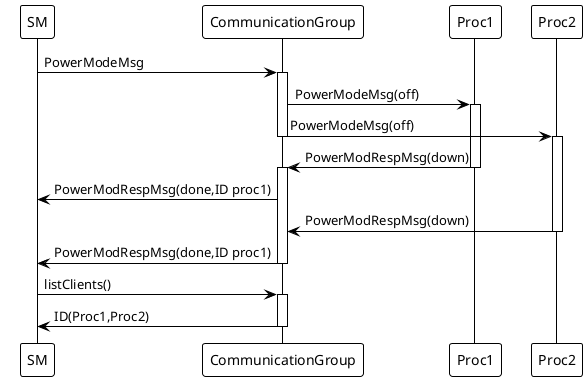

# Specification of State Management

## 1. State Management Responsibilities
**State Management**: The element defining modes of operation for AUTOSAR Adaptive Platform. It allows flexible definition of functions which are active on the platform at any given time.
1. State Management is the functional cluster which is responsible for **determining the current internal States**, and for **initiating Function Group** and **Machine State transitions** by requesting them from Execution Management.
2. State Management is the central point where any operation event is received that might have an influence to the internal States of State Management. The State Management is responsible to **evaluate** these events and decide based on Event type, Event priority, Application identifier.
If an State Managements internal State change is triggered then Execution Management may be requested to set Function Groups or Machine State into new Function Group State.

The state change request for Function Groups can be issued by several AUTOSAR Adaptive Platform Applications:
1. **Platform Health Management** to trigger error recovery, e.g. to activate fallback Functionality.
1. **Adaptive Diagnostics** to switch the system into different diagnostic states and to issue resets of the system.
1. **Update and Config Management** to switch the system into states wheresoftware or configuration can be updated and updates can be verified.
1. **Network Management** to coordinate required functionality and network state.This is no active request by Network Management. Network Management provides several sets of NetworkHandle fields, where State Management registers to and reacts on changes of these fields issued by Network Management.

**Execution Management**: The element of the AUTOSAR Adaptive Platform responsible for the ordered startup and shutdown of the AUTOSAR Adaptive Platform and Adaptive Applications.
### Start-up Sequence – from Startup to initial running state Driving
```puml
!theme plain
participant OS order 10
participant EM order 20
participant SM order 30
OS -> EM : main()
activate OS
activate EM
group Loop
EM -> SM : CreateProcess(SM)
activate SM
SM -> EM : ExecutionClient::ReportExecutionState(kRunning)
activate EM
deactivate EM
end

SM -> EM : SetState("MachineFG",StateXYZ)
activate EM
deactivate
```
### State Change Sequence – Transition to machine state StateXYZ
**Modelled Process**: A Modelled Process is an instance of an Executable to be executed on a Machine and has a 1:1 association with the ARXML/Meta-Model element Modelled Process. This document also uses the term **process** (without the “modelled” prefix)to refer to the OS concept of a running process.
An arbitrary state change sequence to machine state StateXYZ is illustrated in Figure7.2. Here, on receipt of the state change request, Execution Management terminates running Modelled Processes and then starts Modelled Processes active in the new state before confirming the state change to State Management.
```puml
!theme plain
participant EM order 10
participant SM order 20
participant App1 order 30
participant App2 order 40

SM -> EM : SetState("MachineFG",StateXYZ)
activate EM
activate SM
group loop
    EM -> App1 : SIGTERM(all process)
    activate App1
    App1 -> EM : ExecutionClient::ReportExecutionState(kTerminating)
    EM -> EM :WaitForTermination(App1)
    activate EM
    deactivate EM
    deactivate App1
end

group loop
    EM -> App2 : CreateProcess(allApps)
    activate App2
    App2 -> EM : ExecutionClient::ReportExecutionState(kRunning)
    activate EM
    deactivate EM
    deactivate App2
end
EM -> SM ::kSuccess
```

### Non-Synchronized Application State handling

```puml
!theme plain
participant Application1 order 10
participant TriggerIn order 20
participant StateManagement order 30
participant TriggerOut order 40
participant Application2 order 50

Application2 -> TriggerOut :subscribe()

Application1 -> TriggerIn : write()
activate Application1
activate TriggerIn
deactivate Application1
TriggerIn -> StateManagement : event()
activate StateManagement
deactivate TriggerIn
StateManagement -> StateManagement : CheckGuardCondition(s)
StateManagement -> TriggerOut : write(state)
activate TriggerOut
deactivate StateManagement
TriggerOut -> Application2 : event()
activate Application2
Application2 -> Application2 : DoSomething
deactivate TriggerOut
activate Application2
deactivate Application2
```


```puml
!theme plain
participant App1 order 10
participant TriggerIn order 20
participant StateManagement order 30
participant TriggerOut order 40
participant IfcGetState order 50
participant EM order 50
participant IfcRequestState order 50
App1 -> TriggerIn: Write()
TriggerIn -> StateManagement:event()
activate StateManagement
StateManagement->StateManagement:check GuardCondition()
StateManagement->TriggerOut:write(pre_state)
StateManagement->IfcRequestState:SetState()
IfcRequestState->EM
EM->EM:SetFuncGroupState()
StateManagement->IfcGetState:GetState()
StateManagement->TriggerOut:write(final_state)
```
```puml
!theme plain
skinparam linetype ortho
interface StateClient{
    # *State*()
    - GetExecutionError()
    # GetInitialMachineStateTransitionResult()
    # undefinedStateCallback()
}
interface ExecutionClient{
    +ReportApplicationState()
}
component State_Management{
}
component Execution_Management{
}
component Process{
}

Execution_Management -up-> State_Management :start/\nterminal
StateClient -down-> Execution_Management
State_Management -down-> StateClient
Process --down--> ExecutionClient
ExecutionClient --down--> Execution_Management
State_Management --right--> ExecutionClient
Execution_Management--left--> Process:S/T
```
```puml
!theme plain
component StateManagement{
}
component NetworkManagement{
}
interface NetworkHandel{
    +NetworkCurrentState()
    +NetworkRequestState()
}
StateManagement --right--> NetworkHandel
NetworkHandel --right--> NetworkManagement
```

```puml
skinparam linetype ortho
component StateManagement{
}
component Process{

}
interface CommunicationGroupServer{
    +BoardCast()
    +ListClients()
    +Message()
    +Response()
}
interface CommunicationGroupClient{
    +message()
    +response()
}
() PowerModeMsg
() PowerModeRespMsg
PowerModeMsg --down--> Process
Process --up--> PowerModeRespMsg
```