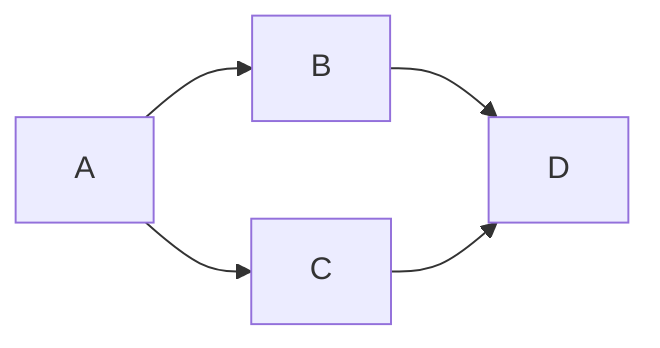

<!-- ~~~mermaid
pie  
"喜欢宅" : 15
"天气太热或太冷" : 20
"穷" : 500
~~~ -->

~~~mermaid
sequenceDiagram
网友 ->> + 淘宝 : 网购钟意的商品
淘宝 -->> - 网友 : 下单成功

loop 一天七次
    网友 ->> + 淘宝 : 查看配送进度
    淘宝 -->> - 网友 : 配送中
end
~~~

~~~mermaid
classDiagram
    Animal <|-- Duck

~~~
