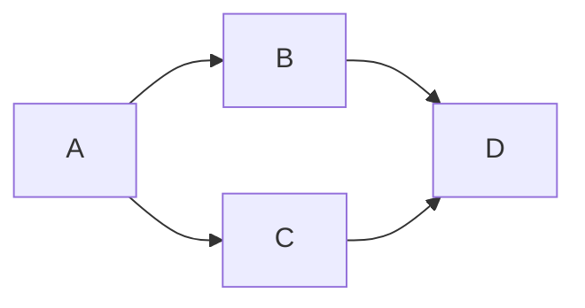

<!-- ~~~mermaid
pie  
"喜欢宅" : 15
"天气太热或太冷" : 20
"穷" : 500
~~~ -->

~~~mermaid
sequenceDiagram
网友 ->> + 淘宝 : 网购钟意的商品
淘宝 -->> - 网友 : 下单成功

loop 一天七次
    网友 ->> + 淘宝 : 查看配送进度
    淘宝 -->> - 网友 : 配送中
end
~~~

~~~mermaid
classDiagram
    Animal <|-- Duck
    Animal <|-- Fish
    Animal <|-- Zebra
    Animal : int age
    Animal : String gender
    Animal: isMammal()
    Animal: mate()
    class Duck{
      String beakColor
      swim()
      quack()
    }
    class Fish{
      int sizeInFeet
      canEat()
    }
    class Zebra{
      bool is_wild
      run()
    }
~~~