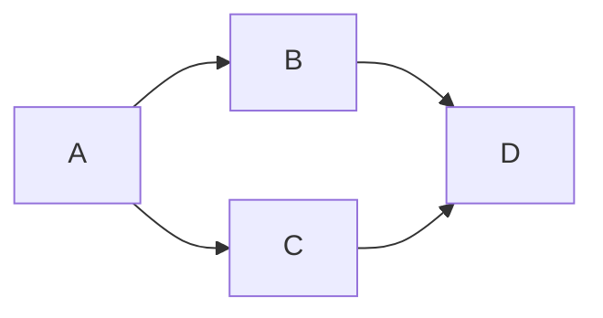

```mermaid
graph LR;
A-->B;
A-->C;
B-->D;
C-->D;
```
~~~mermaid
pie  
"喜欢宅" : 15
"天气太热或太冷" : 20
"穷" : 500
~~~

~~~mermaid
sequenceDiagram
Alice->>John: Hello John, how are you?
John->>Alice: Great!
~~~
