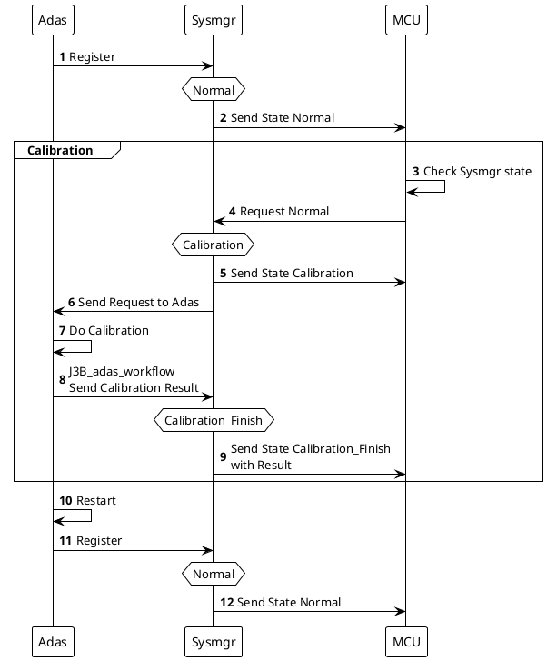
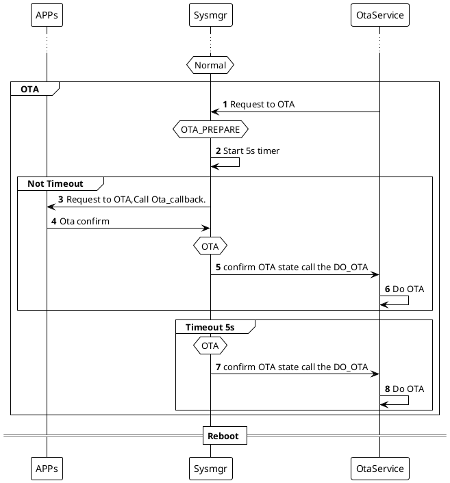
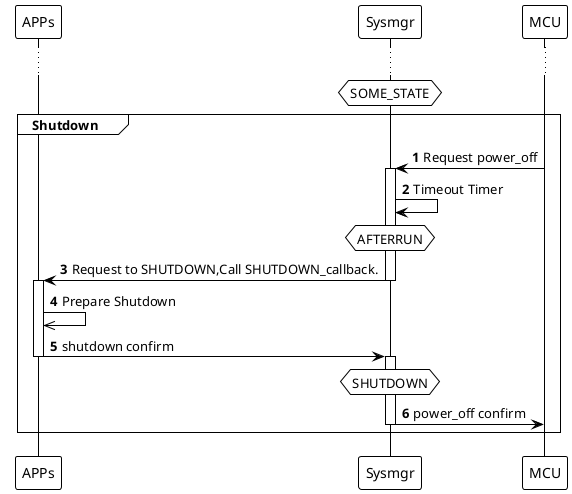
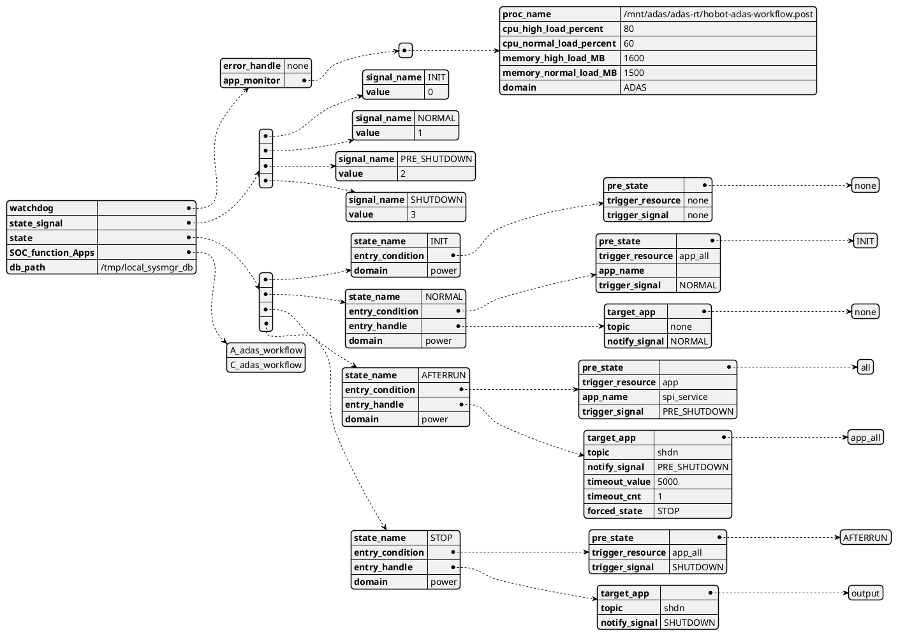

# SYSMGR介绍
&emsp;&emsp;本文主要从以下几个方面介绍状态机：系统状态机介绍、系统状态机大致框架、当前主要业务流程和状态机配置使用。
1. 系统状态机是什么
2. 系统状态机大致框架
3. 当前主要业务流程
4. 配置使用
5. 提建议和答疑
## 0 简介
&emsp;&emsp;为什么需要状态机。比如adas需要标定的时候，事先需要知道整个的系统状态，比如当前是否在OTA升级，是否马上要下电了。如果没有状态机，Adas就需要分别与OTA进程，MCU端分别建立连接。在没有状态机的情况下，MCU，定位，规控，感知，OTA等进程就需要建立全连接了。无疑耗费资源，难以管理。针对以上缺点，状态机分别与所有进程建立连接，并将标定，OTA这些重要业务抽象为状态，统一管理。所以状态机最核心的功能就是状态管理，主要负责系统整体状态的切换，广播，管理等。

&emsp;&emsp;此外，状态机还包含状态管理，进程监控与系统监控模块，进程监控负责周期性监控进程是否在运行，以及进程占用的cpu负载，内存负载是否在预期范围内。系统监控负责周期性监控SOC整体的数据，如cpu负载，cpu温度，内存负载，BPU负载等。
&emsp;&emsp;其次，状态机与外部进程的交互统一通过**libsysmgr.so**动态库提供的相关接口。用户只需要注册、回调就行了。
1 状态机主要功能如下：
* 状态机管理主要状态不冲突
* 状态机管理各状态先后顺序
* 状态机监控Proc状态
* 状态机监控SOC状态

2 状态机提供的API，状态机通过libsysmgr.so的与状态机交互。接口如下：
* 状态机提供注册几口
* 状态机提供各种状态回调接口
* 状态机提供请求状态切换的接口
* 状态机提供系统状态，SOC状态的查询接口


## 1 系统状态机大致框架


* 状态机的框架分布的话从下往上分为三部分，内核层，状态机层，APP层。

* 内核层消息的输入输出通过相应的通道送入IPC_worker，IPC_worker专门用来从事底层通信，比如直接调用libspi的read函数，zmq的pub、sub。

* ProtocolHandler提供拆分与打包的接口（序列化&反序列化）。通过模板将不同协议转换为状态机可读取的结构。

* IO_handler负责输入输出，主要是发送状态，发送ACK等工作。

* SessionHandler实现ack机制与超时重发。

* MessageDequeueBuffer是输入输出消息的缓存区域，输出的队列有新消息时，相应的线程就会将它发送出去。同样的，有新的消息输入，也会有相应的线程处理消息。

* 上层的APP们就可以通过libsysmgr.so和状态机通信，动态库集成了上面所有的类，用户只需要设置回调就可以了。

* 剩余两个进程监控SOC监控就是隔一段时间就扫描一次状态，超阈值就报诊断。
## 2 状态转移
总的来说，状态的跳转主要是又在下半部分。
首先上电之后，状态机处于init状态，然后重要进程向状态机注册，状态机跳转到normal。
一直等到MCU发来下电消息，状态机进入下电的第一阶段，通知各进程即将下电，各进程进入下电流程，所有下电完成后进入下电第二阶段，状态机对MCU确认下电。
```puml
!theme plain
participant Normal_APP order 10
participant Important_APP order 20
participant Sysmgr order 30
hnote over Sysmgr:Init
Normal_APP-->Sysmgr:Register
Important_APP->Sysmgr:Register
hnote over Sysmgr:Normal

...
Sysmgr <-:Request Entry SomeState
group Transit State

Sysmgr->Important_APP:Notify **Related** Apps
activate Important_APP
Important_APP->Important_APP:Run CallbackFunction
Important_APP->Sysmgr:State Confirm
deactivate Important_APP

Sysmgr->Normal_APP:Notify **Related** Apps
activate Normal_APP
Normal_APP->Normal_APP:Run CallbackFunction
Normal_APP->Sysmgr:State Confirm
deactivate Normal_APP
end
hnote over Sysmgr:State
```
```puml
!theme plain
participant App1 order 10
participant App2 order 20
participant Sysmgr order 30
App1 -> Sysmgr :Register()
App2 -> Sysmgr :Register()
group Transit State Loop
Sysmgr <-:Request Entry SomeState
activate Sysmgr
Sysmgr -> Sysmgr :CheckCondition()
Sysmgr -> App1: PubMessage()
activate App1
App1 -> App1 :DoSomething()
Sysmgr -> App2: PubMessage()
Activate App2
App2 -> App2 :DoSomething()
App1-> Sysmgr :Confirm()
deactivate App1
App2 -> Sysmgr : Confirm()
deactivate App2 
deactivate Sysmgr
end
```
## 1 Calibration 流程


1. J3上电，状态机进入init状态。ADAS启动并向状态机发送注册。
2. 状态机进入Normal状态，并发送Normal状态给MCU。
3. MCU接收到UDS进入标定命令，然后检查J3状态，若J3未处于normal，则条件不满足。
4. 若J3处于normal，发送状态切换报文请求进入标定状态
5. 通知APP开始标定
6. APP回复确认标定
7. SysMgr将系统状态从Normal切换为Camera_Onl_Calibration，SysMgr再将状态（eg:Camera_Onl_Calibration）回复给MCU,MCU可根据一定时间内是否收到状态切换报文来判断请求标定的消息是否正确送达。
8. 标定期间，仍然保持心跳通信，state对应为标定状态。
9. ADAS标定结束后将结果发送给SysMgr，同时通知SysMgr将系统状态从Camera_Onl_Calibration切换至Camera_Onl_Calibration_finish，
10. SysMgr会把状态切换到Camera_Onl_Calibration_finish状态,SysMgr会把Camera_. Onl_Calibration_finish状态以及标定结果发给MCU；. MCU接收SOC发送的标定结果报文，判断标定结果；若一定时间内MCU未收到标定结果，则认为标定超时。
11. ADAS标定完成后重启
12. ADAS重启回到normal状态，重新注册，SysMgr切换到Normal。


## 2 OTA 流程


0. 所有App包括OTAService调用状态机注册接口后，状态机进入**NORMAL**。
0. OtaService向状态机请求进入OTA。状态机在NORMAL状态收到请求，立即进入**OTA_PREPARE**状态
0. 状态机在进入**OTA_PREPARE**后，会开启一个5s的计时器。
0. 状态机向所有的APPs发送进入OTA请求，调用其Ota_callback回调
0. 所有APPs在准备好后，回复状态机confirm，状态机进入**OTA**状态。
0. 状态机向OtaServce确认OTA状态
0. OtaService及其相关进程进行OTA工作。

## 3 下电流程

1. 在**NORMAL**，**INIT**，**SYS_FAULT**状态下，MCU向状态机请求下电。
2. 状态机接收到请求后，立即进入AFTERRUN状态，并开启一个5s计时器。
3. 状态机向APPs发送下电请求，并调用**shutdown_callback**
4. 各APP完成下电工作后，向状态机确认下电。
5. 状态机在收到所有下电确认后，切换到**SHUTDOWN**状态，并向MUC确认下电。
6. 在超时情况下，状态机开启的5s计时器会强行将状态切换到**SHUTDOWN**状态。并向MCU确认下电。

## Json

