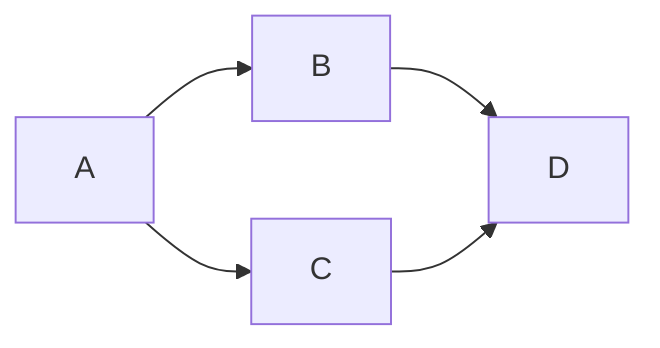
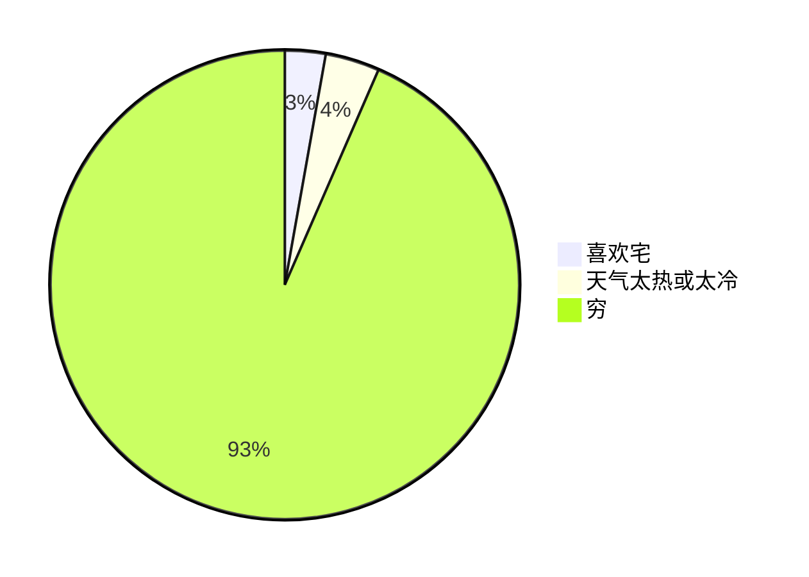
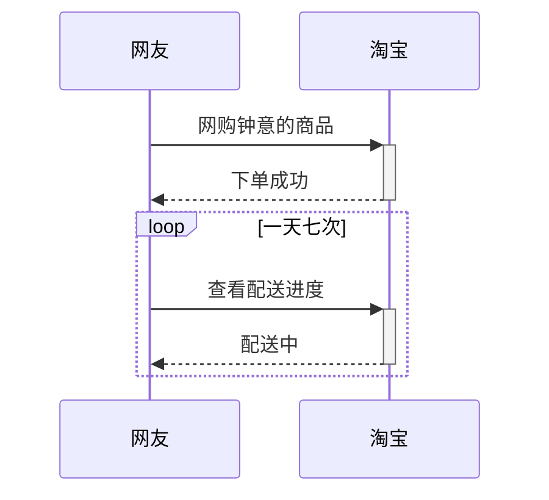
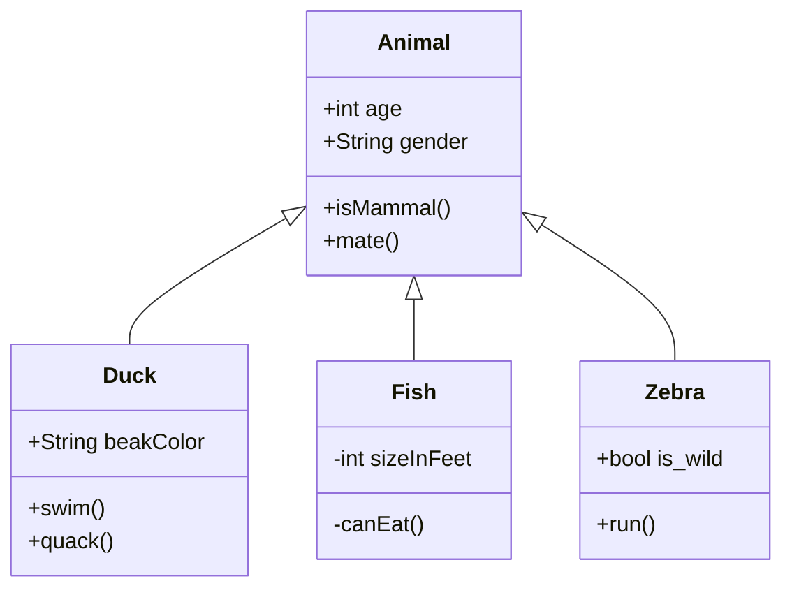
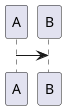

$c = \sqrt{a^{2}+b_{xy}^{2}+e^{x}}$

```latex {cmd=true hide}
\documentclass{standalone}
\usepackage{tikz}
\begin{document}
\begin{tikzpicture}
\draw[rounded corners] (1,3)--(2,2)--(4,5);
\end{tikzpicture}
\end{document}
```

