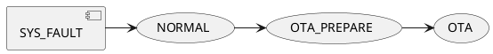
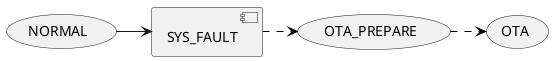
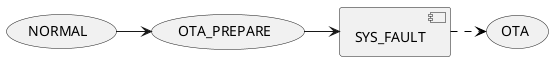
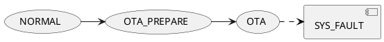

```puml
@startuml
[SYS_FAULT]->(NORMAL)
(NORMAL)->(OTA_PREPARE)
(OTA_PREPARE)->(OTA)
@enduml
```

```puml
@startuml
(NORMAL) -> [SYS_FAULT]
[SYS_FAULT] .[#000000]right.> (OTA_PREPARE)
(OTA_PREPARE) .[#000000]right.>(OTA)
@enduml
```

```puml
@startuml
(NORMAL)->(OTA_PREPARE)
(OTA_PREPARE)->[SYS_FAULT]
[SYS_FAULT] .[#000000]right.>(OTA)
@enduml
```

```puml
@startuml
(NORMAL)->(OTA_PREPARE)
(OTA_PREPARE)->(OTA)
(OTA) .[#000000]right.>[SYS_FAULT]
@enduml
```